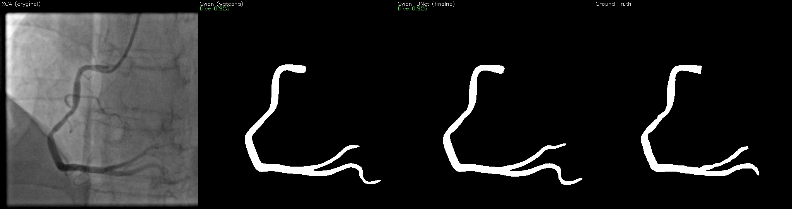
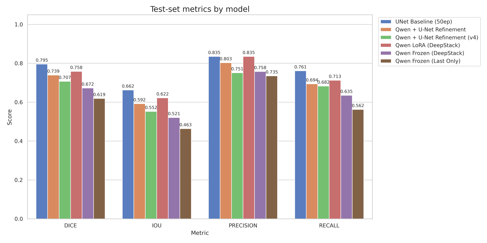
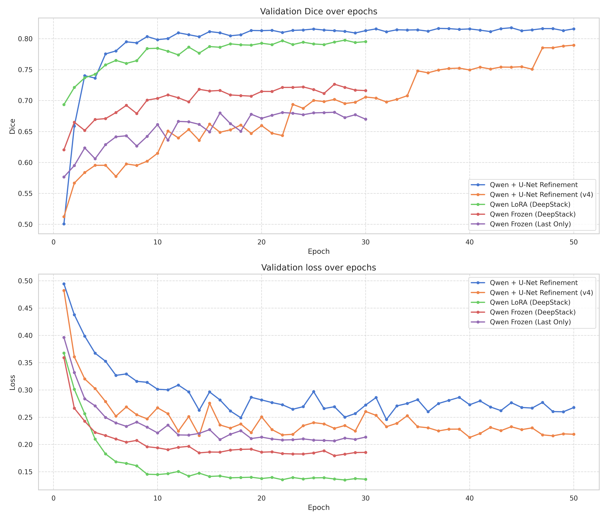
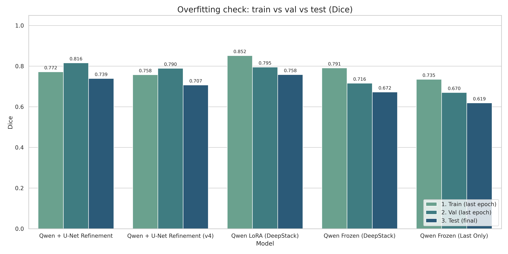
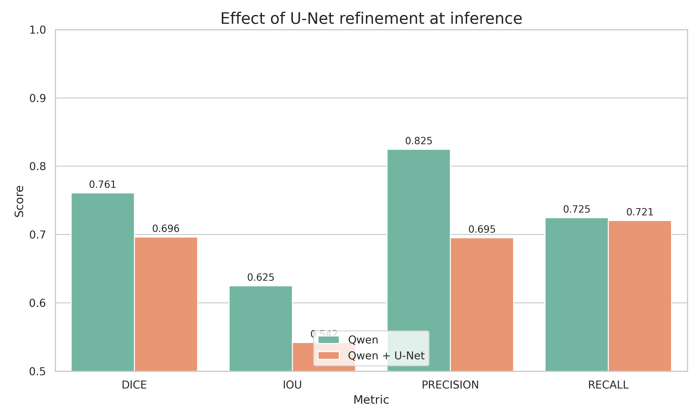

# arterio-AI-segmentation

**Binary coronary vessel segmentation on X-ray angiography (XCA), with a vision–language backbone.**

Part of the Arterio ecosystem. The practical goal is automatic / semi-automatic labeling of angiographic
frames, so that raw angiograms can be turned into training data for downstream cardiology AI without a
cardiologist tracing every vessel by hand.

The research question is narrower and more interesting:

> Can the frozen vision tower of a general-purpose multimodal LLM (**Qwen3-VL-8B-Instruct**) — a model that
> has never seen a coronary angiogram in a segmentation objective — be turned into a vessel segmenter that
> competes with a purpose-built, ImageNet-pretrained **U-Net**, the gold standard for this task?

**Short answer: yes, almost.** A LoRA-adapted Qwen3-VL vision tower with DeepStack feature fusion and a small
CNN decoder reaches **Dice 0.758 / IoU 0.622** on the ARCADE test split, against **0.795 / 0.663** for the
U-Net baseline — a gap of 3.7 Dice points (≈4.7% relative), with **identical precision (0.835)**. Everything
below documents how we got there, what we changed in the Qwen path, and which of our ideas actually helped.

### Authors
This work was a part of a group project on Gdańsk University of Technology. Tool was created for the Arterio ecosystem (coronary vessel segmentation on XCA).

- Franciszek Borys [@FranBory](https://github.com/FranBory)

- Jan Bancerewicz [@JanBancerewicz](https://github.com/JanBancerewicz)

- Julia Augustyniak [@Julia-A1202](https://github.com/Julia-A1202)

- Patryk Lewandowski [@PatrykColo](https://github.com/PatrykColo)

Gdańsk University of Technology, 2026

---

## Table of contents

- [What the model sees](#what-the-model-sees)
- [Dataset — ARCADE](#dataset--arcade)
- [The pipeline, step by step](#the-pipeline-step-by-step)
- [How we use Qwen3-VL for segmentation](#how-we-use-qwen3-vl-for-segmentation)
- [Our modifications](#our-modifications)
- [Results](#results)
- [What the experiments tell us](#what-the-experiments-tell-us)
- [Environment & setup](#environment--setup)
- [Running it](#running-it)
- [Repository map](#repository-map)

---

## What the model sees

One test frame, produced by [`inference_qwen_unet.py`](inference_qwen_unet.py)
(`results/infer/panels/195_panel.png`):



Left: the Qwen prediction overlaid on the XCA frame. Middle: the same frame after the U-Net refiner.
Right: the ground-truth mask. In the overlays, **green = true positive**, **red = false positive**,
**blue = false negative**. (The panel labels are rendered in Polish — *wstępna* = preliminary /
Qwen-only, *finalna* = final / refined.)

This is the whole task in one picture: the left main and its branches are recovered nearly end to end,
the catheter and the distal, low-contrast segments are where the errors live, and the refiner in this
example trades precision for nothing — a pattern that turns out to be systematic (see
[What the experiments tell us](#what-the-experiments-tell-us)).

---

## Dataset — ARCADE

We use the **ARCADE** challenge dataset (Automatic Region-based Coronary Artery Disease diagnostics using
X-ray angiography images), specifically its **SYNTAX** track:

- **Source:** <https://www.kaggle.com/datasets/nirmalgaud/arcade-dataset>
- **Modality:** X-ray coronary angiography, single frames, 512×512, grayscale
- **Splits used:** train / val / test ≈ **1000 / 200 / 300** images
- **Annotations:** COCO-style polygons, one category per coronary segment (SYNTAX score numbering)

For this repository the task is **binary**: all SYNTAX segment classes are merged into a single
`vessel` foreground. [`convert_mask.py`](convert_mask.py) rasterizes the COCO polygons into
binary PNG masks (255 = vessel, 0 = background) and can dump a few overlay previews for sanity checking.

Expected layout on disk:

```
data/
  syntax/{train,val,test}/images/          # 512×512 PNG frames
  syntax/{train,val,test}/annotations/*.json   # COCO polygons
  masks/{train,val,test}/                  # generated by convert_mask.py (not in git)
```

`data/stenosis/` (the other ARCADE track) is **not** used by this segmentation pipeline.

Two properties of this data drive almost every design decision below:

1. **Extreme class imbalance** — vessels occupy roughly 2–5% of pixels. Hence a Dice-based loss everywhere,
   a decoder head bias initialised to ≈`logit(0.1)`, and `pos_weight=20` in the hybrid.
2. **Thin, branching, topology-critical structures** — a 2-pixel break in a vessel barely moves Dice but
   destroys the clinical usefulness of the mask. Hence clDice in [`evaluate.py`](evaluate.py) and the
   connectivity loss in the hybrid.

---

## The pipeline, step by step

```
        ARCADE SYNTAX (COCO polygons)
                    │
      ┌─────────────▼─────────────┐
 (1)  │  convert_mask.py          │   polygons → binary masks
      └─────────────┬─────────────┘
                    │  data/masks/{train,val,test}/
      ┌─────────────▼─────────────┐
 (2)  │  dataset.py +             │   512×512, geometric + photometric aug
      │  augmentations.py         │   (flips, rotate ±20°, elastic, brightness/contrast)
      └──────┬──────────────┬─────┘
             │              │
   ┌─────────▼───────┐  ┌───▼────────────────────────────────────────┐
(3)│ train_unet.py   │  │ train_qwen_seg_new.py                      │(4)
   │ ResNet-34 U-Net │  │ Qwen3-VL vision tower → DeepStack →        │
   │ (the baseline)  │  │ SegDecoder,  frozen | LoRA                 │
   └─────────┬───────┘  └───┬────────────────────────────────────────┘
             │              │  checkpoints/qwen_seg_best_LoRA_deepstack.pth
             │              │
             │        ┌─────▼──────────────────────────────────────┐
             │   (5)  │ qwen_unet_pipeline.py                      │
             │        │ frozen Qwen mask ⊕ RGB → U-Net refiner     │
             │        └─────┬──────────────────────────────────────┘
             │              │  checkpoints/qwen_unet_best.pth
      ┌──────▼──────────────▼──────┐
 (6)  │ evaluate.py /              │   Dice, IoU, precision, recall, clDice
      │ inference_qwen_unet.py /   │   masks, panels, metrics.json
      │ generate_plots.py          │   figures in results/plots_en/
      └────────────────────────────┘
```

**Step 1 — masks.** `convert_mask.py` reads each split's COCO JSON, merges every polygon category into one
foreground, and writes `data/masks/<split>/<stem>.png`. `--vis N` saves N overlay previews per split.

**Step 2 — data loading.** Frames are grayscale; they are replicated to 3 channels because both the
ImageNet encoder and the Qwen image processor expect RGB. Training augmentations: horizontal flip (p=0.5),
vertical flip (p=0.2), rotation ±20°, elastic transform (p=0.3), brightness/contrast jitter. Validation and
test are resize-only. For the Qwen path, normalisation is left to the Qwen `image_processor`, so only
geometric + mild photometric augmentation is applied before it.

**Step 3 — U-Net baseline.** `segmentation_models_pytorch` U-Net, ResNet-34 encoder with ImageNet weights,
`0.5·BCE + 0.5·Dice`, AdamW, lr `1e-4`, cosine schedule, 50 epochs, batch 8. This is the reference number
everything else is measured against.

**Step 4 — Qwen segmenter.** Described in detail in the next section. Three ablations are trained:
frozen + last hidden state only, frozen + DeepStack, LoRA + DeepStack.

**Step 5 — hybrid refiner.** The best Qwen checkpoint is frozen and used as a mask proposer; a second,
small U-Net takes `RGB ∥ Qwen mask` (4 channels) and produces the final mask.

**Step 6 — evaluation & figures.** `evaluate.py` scores checkpoints or prediction folders (adding **clDice**,
the topology-aware Dice variant from Shit et al., CVPR 2021, on top of the standard metrics);
`inference_qwen_unet.py` runs the full hybrid over a folder and writes masks, comparison panels and
`metrics.json`; `generate_plots.py` renders every figure in this README from `results/*.json`.

---

## How we use Qwen3-VL for segmentation

Qwen3-VL is a generative VLM: image + text in, text out. It has no segmentation head and no notion of a
pixel mask. What it *does* have is a strong ViT vision tower whose features encode structure at multiple
scales. We discard the language model entirely and treat the vision tower as a frozen (or lightly adapted)
feature extractor.

```
XCA frame 512×512
   │
   │  Qwen AutoProcessor.image_processor   (patch 16, spatial_merge 2)
   ▼
flattened patches ──► Qwen3-VL vision tower (model.visual)
   │                        │
   │                        ├─ last_hidden_state          (256 tokens × 4096)
   │                        └─ deepstack_features         (ViT layers 8, 16, 24)
   ▼
reshape 256 tokens → (B, 4096, 16, 16)
   │
   ├─ DeepStackFusion:  Σ softmax(w)ᵢ · featᵢ        [optional, --deepstack]
   ▼
SegDecoder:  1×1 proj 4096→512 → 5× (bilinear ×2 + 2 conv-BN-ReLU) → 1×1 head
   ▼
logits (B, 1, 512, 512) → sigmoid → binary mask
```

Concretely ([`train_qwen_seg_new.py`](train_qwen_seg_new.py)):

| Piece | Choice | Why |
|-------|--------|-----|
| Backbone class | `Qwen3VLForConditionalGeneration` (transformers ≥ 4.57) | Using a generic `AutoModel` leaves the vision MLP / merger randomly initialised — one of the bugs that cost us an early run |
| Feature source | `model.visual`, `out_hidden_size = 4096` | The merged post-tower features, not raw ViT hidden states |
| Spatial grid | patch 16, `spatial_merge 2` → 512/16/2 = **16×16 = 256 tokens** | Fixed grid per image, so tokens reshape cleanly back to a spatial map |
| Decoder | `SegDecoder`: 4096→512 1×1 projection, then five ×2 upsample stages (512→256→128→64→32→16) | 16×16 → 512×512 is a 32× upsampling; doing it in five conv stages keeps it cheap |
| Head init | bias = −2.2 ≈ `logit(0.1)` | Starts the model pessimistic about vessels, which matches the 2–5% prior and avoids the early all-foreground collapse |
| Loss | `0.5·BCEWithLogits + 0.5·soft Dice` | Identical to the U-Net baseline, so the comparison is fair |
| Precision | bf16 throughout, no `GradScaler`; decoder runs in fp32 | bf16 has enough exponent range that a loss scaler is unnecessary; fp32 in the decoder keeps BatchNorm stable |
| Sharding | `device_map="auto"` for the 8B backbone, decoder pinned to `cuda:0` | An 8B backbone plus activations does not fit on one 16 GB card |
| Batching | custom `qwen_collate_fn` | The Qwen processor emits *flattened* patches without a batch dimension, so batching means concatenating along the token axis and stacking `image_grid_thw` separately |

---

## Our modifications

These are the deltas from "naively bolt a decoder onto a VLM", in the order they mattered.

### 1. DeepStack fusion (`--deepstack`)

Qwen3-VL's vision tower exposes, besides `last_hidden_state`, three *deepstack* feature banks taken from
intermediate ViT layers (8, 16, 24) at the **same** spatial resolution and channel count. Inside the LLM,
these are injected as residuals into the first three decoder layers — that is what DeepStack is for
upstream. We repurpose them: `DeepStackFusion` learns a softmax-weighted sum

```
fused = Σᵢ softmax(w)ᵢ · featᵢ ,   i ∈ {last, layer8, layer16, layer24},  w init 0 → uniform 0.25
```

and feeds the fused tensor to the decoder. Four scalars of extra parameters. **+5.3 Dice points**
(0.619 → 0.672 frozen). Deeper ViT layers carry semantics; the earlier banks carry the fine, thin-structure
detail that vessel segmentation lives on, and the last layer alone throws it away.

### 2. LoRA on the vision tower (`--lora`)

Full fine-tuning of an 8B backbone is out of reach on 2×16 GB. Instead, LoRA adapters (`r=16`) on the
vision tower's `qkv`, `linear_fc1`, `linear_fc2` projections, trained at **0.1× the decoder learning rate**
(the adapters sit on a pretrained representation; the decoder starts from scratch, so they should not move
at the same speed). **+8.6 Dice points** over frozen+DeepStack (0.672 → 0.758) — the single largest win in
the project, and what closes most of the gap to U-Net.

### 3. The Qwen → U-Net hybrid ([`qwen_unet_pipeline.py`](qwen_unet_pipeline.py))

The idea: let Qwen propose, let a small U-Net (ResNet-34 + scSE attention) clean up, taking
`RGB ∥ Qwen mask` as a 4-channel input. On top of the plain version we tried a stack of ideas aimed
specifically at thin-structure segmentation:

- **Curriculum dilation** — the training target starts as GT dilated with a 9×9 kernel and tapers to
  1×1 (i.e. the true thin GT) over training. Early on, the refiner only has to get the vessel *tree*
  roughly right; the precision requirement arrives later.
- **Soft Qwen mask as input** — the refiner sees a clamped sigmoid, not a thresholded mask, so Qwen's
  uncertainty survives into the second stage.
- **Connectivity loss** — penalises predictions that break a vessel into disconnected fragments
  (dilation-based, warmed up over the first 5 epochs, weight 0.3).
- **Qwen-guided loss** — discourages the refiner from deleting pixels Qwen was highly confident about
  (weight 0.2), i.e. the student is not allowed to casually overrule the teacher.
- **EMA weights** (from epoch 5), early stopping (patience 10), and a **threshold search on the validation
  split** instead of a hardcoded 0.5 (it selects ≈0.30–0.375).
- **Optional TTA** (flips) at inference.

### 4. Evaluation that matches the clinical failure mode

`evaluate.py` adds **clDice** (Shit et al., CVPR 2021, arXiv:2003.07311) to the usual Dice/IoU/precision/
recall. clDice compares skeletons rather than areas, so a mask that is 95% correct by area but severed in
the middle of the LAD is scored as what it is: broken.

---

## Results

All numbers are on the **same ARCADE SYNTAX test split (300 images)**, same metric implementation.

| # | Model | Dice | IoU | Precision | Recall | Best val Dice |
|---|-------|------|-----|-----------|--------|---------------|
| 1 | **U-Net baseline** (ResNet-34, 50 ep) | **0.795** | **0.663** | 0.835 | **0.761** | 0.828 |
| 2 | **Qwen LoRA + DeepStack** | 0.758 | 0.622 | **0.835** | 0.713 | 0.798 |
| 3 | Qwen → U-Net refine | 0.739 | 0.592 | 0.803 | 0.694 | 0.818 |
| 4 | Qwen → U-Net refine (curriculum, v4) | 0.707 | 0.552 | 0.751 | 0.682 | 0.790 |
| 5 | Qwen frozen + DeepStack | 0.672 | 0.521 | 0.758 | 0.635 | 0.726 |
| 6 | Qwen frozen, last hidden only | 0.619 | 0.463 | 0.735 | 0.562 | 0.681 |



The ablation ladder is clean and monotone: **last-hidden-only → +DeepStack → +LoRA** buys
`0.619 → 0.672 → 0.758` Dice. Each modification is worth several points, and none of it required touching
the language model or training more than a few hundred million parameters.

### Learning dynamics



Qwen LoRA+DeepStack (green) converges fastest and to the lowest validation loss of any Qwen variant, and it
does so in 30 epochs at batch size 1. The hybrid runs (blue, orange) reach a *higher* validation Dice —
0.818 and 0.790 — but that advantage does not survive the test split, which is the tell described below.

### Generalization



Qwen LoRA shows the expected, healthy ordering train (0.852) > val (0.795) > test (0.758): a modest ~9-point
train→test gap for a model with trainable adapters. The two hybrid runs show val > train, which is the
signature of the curriculum/dilation target making the *training* objective harder than validation — and
both then drop hardest on test.

### Does the refiner actually refine?



No. On the full 300-image test run (`results/infer/metrics.json`, threshold 0.35, no TTA), the frozen Qwen
mask scores **Dice 0.761 / precision 0.825**, and passing it through the trained U-Net refiner *lowers* it
to **0.696 / 0.695**. Recall is essentially unchanged (0.725 → 0.721): the refiner adds false positives —
it thickens and hallucinates around the proposal rather than cleaning it.

---

## What the experiments tell us

1. **A general-purpose VLM vision tower is a genuinely competitive dense-prediction backbone.** With no
   pixel-level pretraining, Qwen3-VL + a ~6 M-parameter CNN decoder lands within 3.7 Dice points of a
   task-specific ImageNet U-Net, and matches its precision exactly (0.835). The remaining gap is almost
   entirely **recall** (0.713 vs 0.761) — Qwen misses thin distal branches, it does not invent vessels.
   That is the better failure mode for a labeling tool: a human reviewer adds a missing branch faster than
   they erase a spurious one.

2. **Intermediate ViT features are not optional for thin structures.** DeepStack fusion is four learnable
   scalars and is worth +5.3 Dice. The last hidden state alone has already abstracted away the
   high-frequency detail that vessel boundaries consist of.

3. **LoRA on the vision tower is where the remaining accuracy is.** +8.6 Dice for `r=16` adapters on
   `qkv`/`linear_fc1`/`linear_fc2`. Angiography is far enough from the natural-image distribution that the
   frozen representation is not sufficient, but close enough that a low-rank correction suffices — full
   fine-tuning was never needed.

4. **Cascade refinement did not pay off here, and we can say why.** Every hybrid variant scored *below* its
   own Qwen teacher. The refiner is trained on Qwen's *training-set* masks, which are better than the masks
   Qwen produces at test time, so at inference it faces a distribution it never saw. Piling on
   fixes — curriculum dilation, connectivity loss, Qwen-guided loss, EMA, threshold search — made it
   *worse*, not better (0.739 → 0.707): the curriculum in particular biases the refiner toward thick
   vessels, and the taper does not fully undo it. **If a strong single-stage model exists, a second stage
   trained on its outputs needs its own error distribution to learn from, not the teacher's best case.**

5. **Validation Dice is a misleading model-selection signal in this setup.** The hybrids won on validation
   (0.818, 0.790) and lost on test. Threshold tuning on val is part of the reason — it fits the val split.
   Anything picked this way should be confirmed on the held-out split before being believed.

6. **U-Net is still the one to ship for pure accuracy** — 0.795 Dice, orders of magnitude cheaper to train
   and run than an 8B backbone at batch size 1. The value of the Qwen path is not that it beats U-Net today;
   it is that a *frozen general-purpose backbone plus a tiny decoder* gets this close, which is the
   interesting result for multi-task and few-label scenarios where you cannot afford one U-Net per task.

---

## Environment & setup

The numbers above were produced on:

| Component | Version / note |
|-----------|----------------|
| GPU | 2× NVIDIA RTX 4080 SUPER (16 GB), Qwen stages with `device_map="auto"` |
| PyTorch | CUDA build, installed separately (see below) |
| `transformers` | **≥ 4.57** — required for `Qwen3VLForConditionalGeneration` (`requirements.txt` still says ≥4.51; bump it) |
| Other | `peft`, `accelerate`, `segmentation-models-pytorch`, `albumentations`, `qwen-vl-utils`, `seaborn` |

```bash
git clone <this-repo>
cd arterio-AI-segmentation
python -m venv .venv
source .venv/bin/activate

# PyTorch first — pick the index matching your CUDA (example: cu121)
pip install torch torchvision torchaudio --index-url https://download.pytorch.org/whl/cu121

pip install -r requirements.txt
pip install seaborn        # generate_plots.py
```

Then place ARCADE SYNTAX under `data/syntax/…` and build the masks:

```bash
python convert_mask.py --data-root data --vis 5 --seed 42
```

Weights live in `checkpoints/` (`*.pth`, gitignored). To run inference without training you need:

- `checkpoints/unet_best.pth` (or `unet_baseline_full_50ep.pth`)
- `checkpoints/qwen_seg_best_LoRA_deepstack.pth`
- `checkpoints/qwen_unet_best.pth` (hybrid only)

The first Qwen run downloads `Qwen/Qwen3-VL-8B-Instruct` from Hugging Face (log in with a token if the
model is gated for your account).

> On a shared machine, always pin a free GPU with `CUDA_VISIBLE_DEVICES`. `train_unet.py` wraps
> `DataParallel` around **all visible** GPUs and will happily take the whole box otherwise.

Full CLI reference with per-flag notes: [`commands.md`](commands.md).

---

## Running it

### Training from scratch

Order matters — the hybrid needs the Qwen checkpoint.

```bash
# 1) masks
python convert_mask.py --data-root data --vis 5

# 2) U-Net baseline  (~0.795 Dice)
CUDA_VISIBLE_DEVICES=0 python train_unet.py --epochs 50 --batch-size 8

# 3) Qwen LoRA + DeepStack  (~0.758 Dice; also the teacher for the hybrid)
CUDA_VISIBLE_DEVICES=0,1 python train_qwen_seg_new.py --lora --deepstack \
  --epochs 30 --batch-size 1 --lr 1e-4 --lora-r 16 --num-workers 2

# ablations:  --no-lora --deepstack   |   --no-lora   (last hidden only)

# 4) hybrid refiner
CUDA_VISIBLE_DEVICES=0,1 python qwen_unet_pipeline.py \
  --qwen-ckpt checkpoints/qwen_seg_best_LoRA_deepstack.pth \
  --encoder resnet34 --epochs 50 --batch-size 2 --lr 1e-5 \
  --pos-weight 20.0 --max-dilation 9 --min-dilation 1 \
  --conn-weight 0.3 --qwen-weight 0.2 --warmup-conn 5 --ema-start 5 --patience 10
```

Key hyperparameters, for the record:

- **U-Net** — 50 epochs, batch 8, lr `1e-4`, AdamW, cosine schedule, ResNet-34/ImageNet, 512×512.
- **Qwen SegDecoder** — 30 epochs, batch **1**, lr `1e-4` (LoRA adapters at 0.1×), `lora-r 16`, bf16,
  `device_map="auto"`.
- **Hybrid** — 50 epochs, batch 2, lr `1e-5`, `pos-weight 20`, dilation curriculum 9→1, `conn-weight 0.3`,
  `qwen-weight 0.2`, EMA from epoch 5.
- **Inference threshold** — 0.375 from the curriculum hybrid's validation search (0.35 for the run in
  `results/infer/`); `--tta` optional.

### Inference on the test split

```bash
CUDA_VISIBLE_DEVICES=0 python inference_qwen_unet.py \
  --qwen-ckpt checkpoints/qwen_seg_best_LoRA_deepstack.pth \
  --unet-ckpt checkpoints/qwen_unet_best.pth \
  --input data/syntax/test/images/ \
  --masks-dir data/masks/test/ \
  --out-dir results/infer \
  --threshold 0.375 --tta
```

Writes `results/infer/{masks,qwen_masks,unet_probs,panels}/` and `metrics.json` (Qwen-only vs Qwen+U-Net,
aggregate and per image). Point `--input` at a single PNG for a quick smoke test.

### Evaluation and figures

```bash
# 5) Evaluation of Qwen and U-Net
# U-Net from checkpoint
CUDA_VISIBLE_DEVICES=0 python evaluate.py --model unet \
  --checkpoint checkpoints/unet_best.pth --split test --batch-size 8

# Qwen from checkpoint (needs VRAM for the 8B backbone)
CUDA_VISIBLE_DEVICES=0,1 python evaluate.py --model qwen \
  --checkpoint checkpoints/qwen_seg_best_LoRA_deepstack.pth --split test --batch-size 1

# comparison table from saved JSON only, no GPU
python evaluate.py --compare --results-dir results
```

```bash
# 6) Generating plots to visualize results
python generate_plots.py              # PL → results/plots/  +  EN → results/plots_en/
python generate_plots.py --lang en    # English only (the figures used in this README)
```

---

## Repository map

| Path | Role |
|------|------|
| [`convert_mask.py`](convert_mask.py) | ARCADE COCO polygons → binary vessel masks |
| [`dataset.py`](dataset.py) / [`augmentations.py`](augmentations.py) | Data loading + albumentations pipelines |
| [`train_unet.py`](train_unet.py) | U-Net baseline (ResNet-34, ImageNet) |
| [`train_qwen_seg_new.py`](train_qwen_seg_new.py) | Qwen3-VL vision tower + DeepStack fusion + SegDecoder, frozen or LoRA |
| [`qwen_unet_pipeline.py`](qwen_unet_pipeline.py) | Qwen → U-Net hybrid refiner (curriculum, connectivity loss, EMA) |
| [`inference_qwen_unet.py`](inference_qwen_unet.py) | Hybrid inference: masks, panels, per-image metrics |
| [`evaluate.py`](evaluate.py) | Checkpoint / folder / compare evaluation, incl. clDice |
| [`generate_plots.py`](generate_plots.py) | All figures in this README, from `results/*.json` |
| [`commands.md`](commands.md) | Detailed CLI reference (Polish) |
| `checkpoints/` | `.pth` weights (local, gitignored) |
| `results/` | Metrics JSON, plots (`plots_en/`), inference outputs (`infer/`) |

`train_gemma_seg.py` is an inactive sketch and is not part of the comparison.

---

## References

- **ARCADE dataset** — <https://www.kaggle.com/datasets/nirmalgaud/arcade-dataset>
- **Qwen3-VL** — `Qwen/Qwen3-VL-8B-Instruct` on Hugging Face
- **LoRA** — Hu et al., *LoRA: Low-Rank Adaptation of Large Language Models*, arXiv:2106.09685
- **clDice** — Shit et al., *clDice — a Novel Topology-Preserving Loss Function for Tubular Structure
  Segmentation*, CVPR 2021, arXiv:2003.07311
- **U-Net** — Ronneberger et al., *U-Net: Convolutional Networks for Biomedical Image Segmentation*,
  MICCAI 2015, arXiv:1505.04597

## Contact

For questions, please open an issue or contact the authors:

- Jan Bancerewicz (s198099@student.pg.edu.pl)
- Franciszek Borys (s193172@student.pg.edu.pl)
- Julia Augustyniak (s192953@student.pg.edu.pl)
- Patryk Lewandowski (s197891@student.pg.edu.pl)
